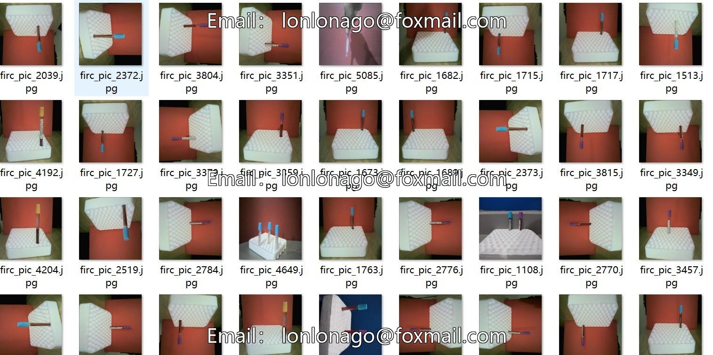
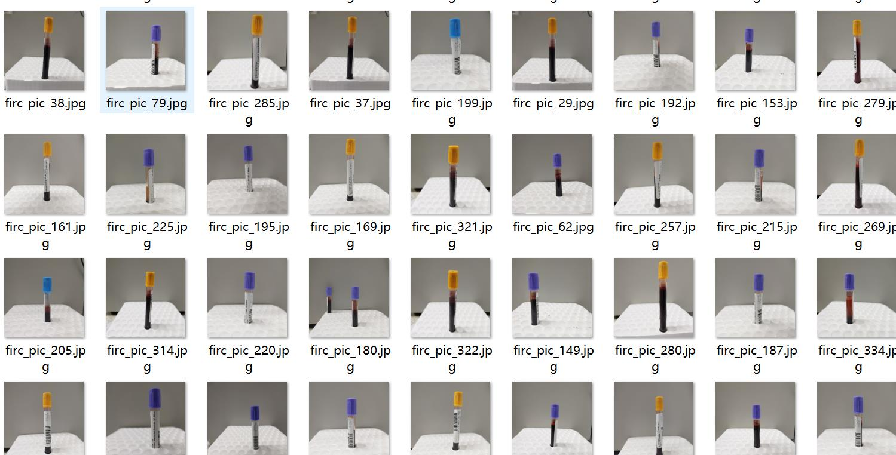
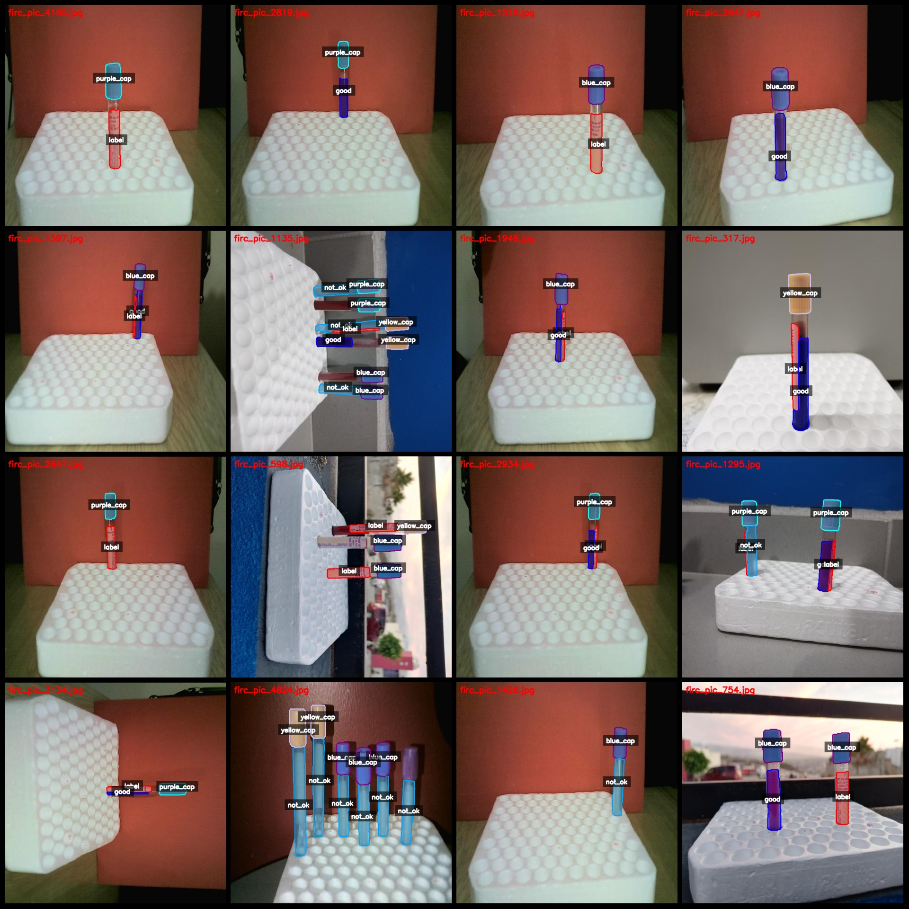
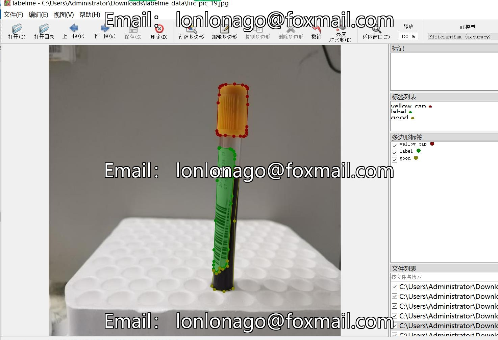

# Smart Medical Medical Collection Tube Labeling Dataset: 5469 Images in LabelMe Format with 6 Categories

Note: The dataset contains enhanced images.
Dataset format: LabelMe (without mask files, only containing jpg images and corresponding json files)
Number of images (number of jpg files): 5469
Number of annotations (json file count): 5469
Number of annotation categories: 6
Annotation category names: ["blue_cap", "good", "label", "not_ok", "purple_cap", "yellow_cap"]
Each category number of boxes:
blue_cap (blue cap) count = 4225
good (qualified) count = 4045
label (label) count = 3393
not_ok (unqualified) count = 4063
purple_cap (purple cap) count = 2971
yellow_cap (yellow cap) count = 2306
Total box count: 21003

Usage instructions for labeling tool: labelme=5.5.0
Image resolution: 640x640
Annotation rules: Polygons are drawn around the categories.
Important note: This dataset can be edited using LabelMe, but the json dataset needs to be converted into either a Mask or Yolo or COCO format for semantic segmentation or instance segmentation.
Special declaration: This dataset does not guarantee any accuracy in training models or weight files.

Image preview:
Annotation example:
Original image (select 16 images at random):
Annotation rendering result:

## Images

Here is a pay link on Stripe ( https://buy.stripe.com/3cs8yP7sY87d0vu9AB ). Please contact me lonlonago@foxmail.com after funding $89, and I will send you a complete data files , thank you!

